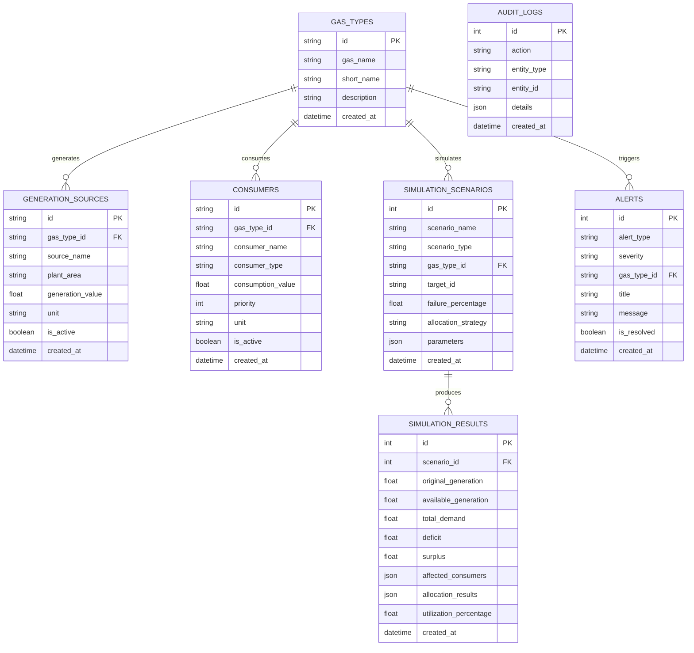

# Database ER Diagram — Tata Steel Fuel Gas Management Intelligence

```mermaid
erDiagram
    GAS_TYPES ||--o{ GENERATION_SOURCES : "generates"
    GAS_TYPES ||--o{ CONSUMERS : "consumes"
    GAS_TYPES ||--o{ SIMULATION_SCENARIOS : "simulates"
    GAS_TYPES ||--o{ ALERTS : "triggers"
    SIMULATION_SCENARIOS ||--o{ SIMULATION_RESULTS : "produces"

    GAS_TYPES {
        string id PK
        string gas_name
        string short_name
        string description
        datetime created_at
    }

    GENERATION_SOURCES {
        string id PK
        string gas_type_id FK
        string source_name
        string plant_area
        float generation_value
        string unit
        boolean is_active
        datetime created_at
    }

    CONSUMERS {
        string id PK
        string gas_type_id FK
        string consumer_name
        string consumer_type
        float consumption_value
        int priority
        string unit
        boolean is_active
        datetime created_at
    }

    SIMULATION_SCENARIOS {
        int id PK
        string scenario_name
        string scenario_type
        string gas_type_id FK
        string target_id
        float failure_percentage
        string allocation_strategy
        json parameters
        datetime created_at
    }

    SIMULATION_RESULTS {
        int id PK
        int scenario_id FK
        float original_generation
        float available_generation
        float total_demand
        float deficit
        float surplus
        json affected_consumers
        json allocation_results
        float utilization_percentage
        datetime created_at
    }

    ALERTS {
        int id PK
        string alert_type
        string severity
        string gas_type_id FK
        string title
        string message
        boolean is_resolved
        datetime created_at
    }

    AUDIT_LOGS {
        int id PK
        string action
        string entity_type
        string entity_id
        json details
        datetime created_at
    }
```
